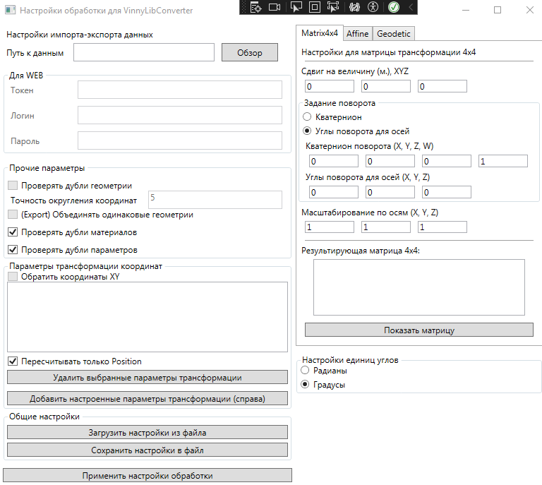

# VinnyLibConverter

Библиотека для преобразования информационных моделей (чтение\запись).

https://github.com/Vinny-Environment/VinnyLibConverter

## Основные компоненты

* `VinnyLibConverterCommon`: описывает структуру информационной модели (VinnyLibDataStructureModel), CDE-нейтральное представление. Содержит вспомогательные опредеелния классов;
* `VinnyLibConverterKernel`: библиотека, осуществляющая чтение, запись, конвертацию различных информационных моделей;
* `VinnyLibConverterCLI`: консольная версия `VinnyLibConverterKernel` (командный режим) для преобразования информационных моделей в иные возможные представления;
* `VinnyLibConverterUI`: net6.0-windows библиотека с окном WPF для настройки параметров обработки *ImportExportParameters*;
* `VinnyLibConverterLogger`: вспомогательный компонент для логгирования ошибок и сообщений;

### Набор библиотек-конвертеров

Приводимые ниже библиотеки собираются в каталог `\dependencies` в соответствующие подкаталоги.

* `VinnyLibConverter_DotBIM`: поддержка формата DotBIM (https://dotbim.net/). Используется, в основном, только для тестирования логики приложения и отладки;
* `VinnyLibConverter_SMDX`: поддержка формата SMDX (https://smdx.info/). Реализовано ограниченное чтение (плохо: некоторые типы геометрий, текстуры, дерево параметров) и ограниченная запись (параметры);
* `VinnyLibConverter_nwcreate`: поддержка записи в формат Autodesk NWC, для Autodesk Navisworks (NWcreate-library);

# Установка

Настоящий конвертер и все используемые библиотеки, а также все плагины распространяется в виде одного пакета файлов. Релизные версии см. в [разделе Releases](https://github.com/Vinny-Environment/VinnyLibConverter/releases).

Приведенный архив необходимо распаковать куда-либо на ПК. Для обновления -- распаковать с заменой файлов.

> Желательно распаковывать по пути, для записи в каталог которого не нужны повышенные права, например, не-С диск или корень диска С. Также в имени желательно не иметь символы кириллицы и пробелы (исключение со стороны библиотеки PROJ в случае использования геодезических преобразований); в остальных случаях проблем с путями быть не должно.
> 
> В зависимости от пути установки для некоторых плагинов нужно будет изменить некоторые параметры конфигурации, информация об этом дополнительно приведена в репозиториях с плагинами.

# Использование

Использование настоящего конвертера возможно в двух вариантах: программно, задействуя методы библиотеки `VinnyLibConverterKernel` и с помощью утилиты `VinnyLibConverterCLI` с использованием параметров командной строки:
Утилита предполагает один из приведенных ниже вариантов использования:

* `-showForImport` или `-showForExport` запускает окно формирования параметров обработки. Для работы с файлами важно задать только путь к файлу с помощью кнопки "Обзор". Принципиальное отличие команд `-showForImport` и `-showForExport` друг от друга состоит лишь в том, что по нажатию на кноку "Обзор" откроется диалог выбора файлов и сохранения файла соответственно;
* `-convert` `path1` `path2` запускает фоновую конвертацию одиной модели в другую. Параметры для чтения `path1`и записи `path2` модели приводятся в виде пути к XML-файлу конфигурации (получается сохранением параметров в окне выше, кнопка "Сохранить настройки в файл");

Окно редактирования настроек после вызова выглядит следующим образом (см. выше). Для трансформации координат возможно использование нескольких трансформаций:

* смешение, поворот, масштабирование в виде матрицы 4x4;

* аффинново преобразование (искажение длин);

* геодезическое преобразование (пересчет координат);

Настроив в текстовых полях численные и строковые (для геодезического преобразования) параметры следует нажать на кнопку "Добавить настроенные параметры трансформации (справа)" в число параметров обработки файла. В текстовом поле в виде строки будут подсвечены параметры трансформации.

Флажок "Пересчитать только Position" означает, что пересчету будут подвержены только точки вставки геометрий, а не вся геометрия целиком (в противном случае скорость пересчета увеличится и размер файла возрастет).

Команда "Применить настройки обработки" завершает настройку параметров. Для использования в составе плагинов она является завершающей. Для использования в составе утилиты `VinnyLibConverterCLI` Вам необходимо только сохранить параметры обработки, а закрыть окно можете любым способом.

# TODO

* Добавить к настройкам чтения/записи инвертирование координат XY;

* Добавить к настройке поворота объекта (GeometryPlacementInfo) углы Эйлера (6 углов);

* Добавить в окно настройки экспорта из ПО опцию "Объединять одинаковую геометрию" -- для клонов создавать GeometryPlacementInfo с параметрами трансформации относительно первого;

